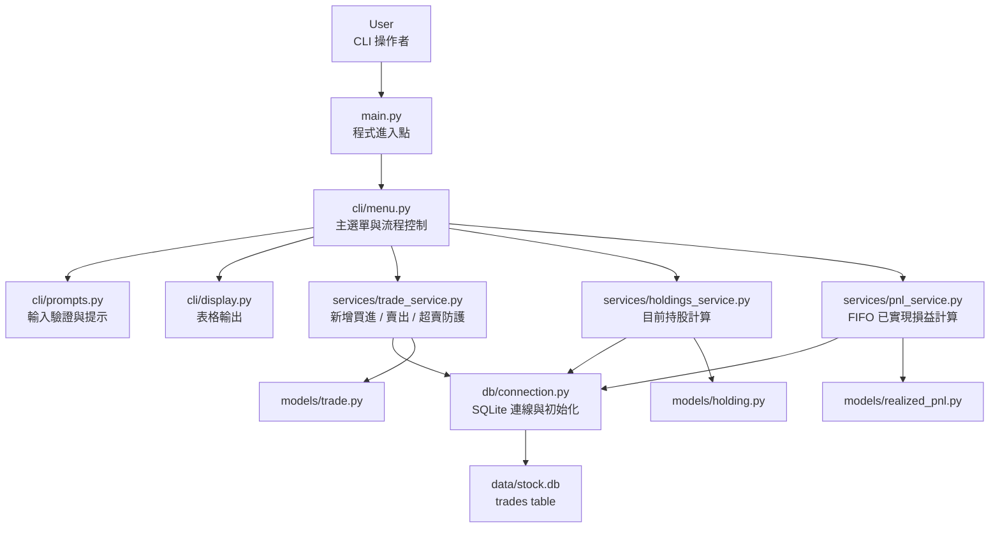
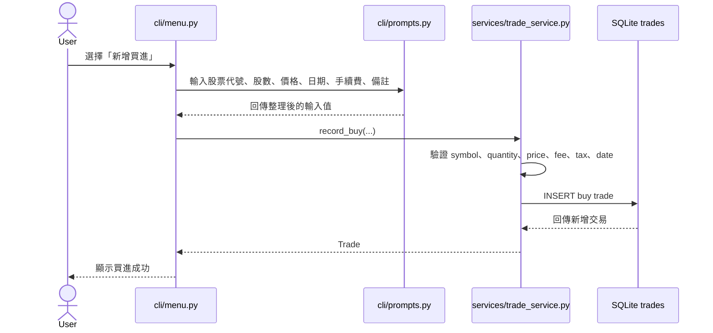
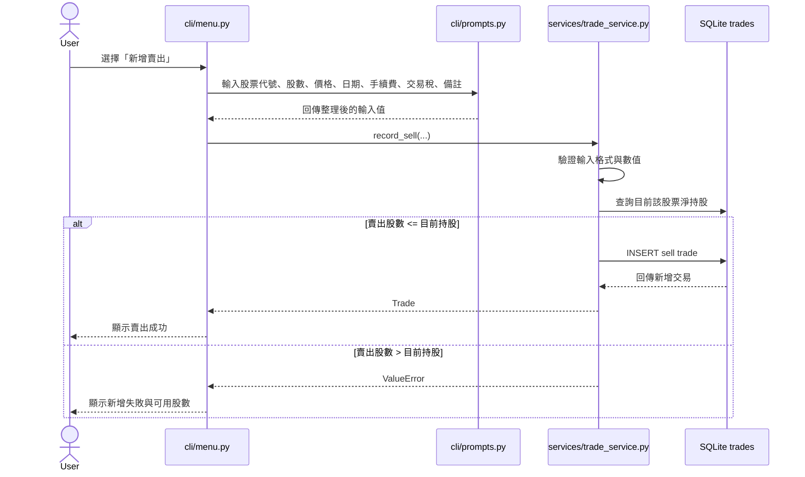
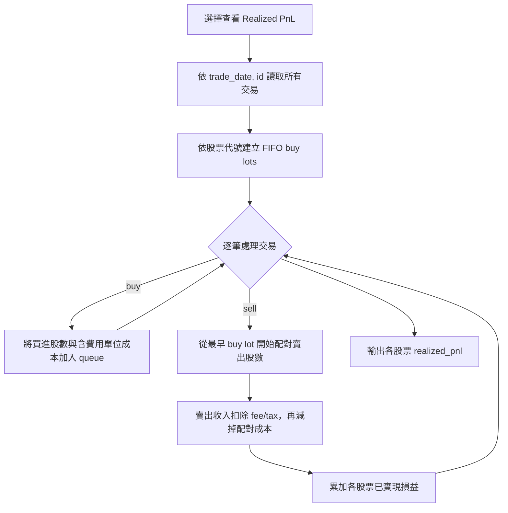

# Stock Master System Design

這份文件描述 Stock Master 目前的模組架構與主要操作流程，可作為 README 之外的技術說明。

## Architecture

```mermaid
flowchart TD
    User["User<br/>CLI 操作者"] --> Main["main.py<br/>程式進入點"]
    Main --> Menu["cli/menu.py<br/>主選單與流程控制"]
    Menu --> Prompts["cli/prompts.py<br/>輸入驗證與提示"]
    Menu --> Display["cli/display.py<br/>表格輸出"]

    Menu --> TradeService["services/trade_service.py<br/>新增買進 / 賣出 / 超賣防護"]
    Menu --> HoldingsService["services/holdings_service.py<br/>目前持股計算"]
    Menu --> PnLService["services/pnl_service.py<br/>FIFO 已實現損益計算"]

    TradeService --> DB["db/connection.py<br/>SQLite 連線與初始化"]
    HoldingsService --> DB
    PnLService --> DB
    DB --> SQLite["data/stock.db<br/>trades table"]

    TradeService --> Trade["models/trade.py"]
    HoldingsService --> Holding["models/holding.py"]
    PnLService --> RealizedPnL["models/realized_pnl.py"]
```

## Buy Flow

```mermaid
sequenceDiagram
    actor User as User
    participant Menu as cli/menu.py
    participant Prompts as cli/prompts.py
    participant TradeService as services/trade_service.py
    participant DB as SQLite trades

    User->>Menu: 選擇「新增買進」
    Menu->>Prompts: 輸入股票代號、股數、價格、日期、手續費、備註
    Prompts-->>Menu: 回傳整理後的輸入值
    Menu->>TradeService: record_buy(...)
    TradeService->>TradeService: 驗證 symbol、quantity、price、fee、tax、date
    TradeService->>DB: INSERT buy trade
    DB-->>TradeService: 回傳新增交易
    TradeService-->>Menu: Trade
    Menu-->>User: 顯示買進成功
```

## Sell Flow With Oversell Protection

```mermaid
sequenceDiagram
    actor User as User
    participant Menu as cli/menu.py
    participant Prompts as cli/prompts.py
    participant TradeService as services/trade_service.py
    participant DB as SQLite trades

    User->>Menu: 選擇「新增賣出」
    Menu->>Prompts: 輸入股票代號、股數、價格、日期、手續費、交易稅、備註
    Prompts-->>Menu: 回傳整理後的輸入值
    Menu->>TradeService: record_sell(...)
    TradeService->>TradeService: 驗證輸入格式與數值
    TradeService->>DB: 查詢目前該股票淨持股
    alt 賣出股數 <= 目前持股
        TradeService->>DB: INSERT sell trade
        DB-->>TradeService: 回傳新增交易
        TradeService-->>Menu: Trade
        Menu-->>User: 顯示賣出成功
    else 賣出股數 > 目前持股
        TradeService-->>Menu: ValueError
        Menu-->>User: 顯示新增失敗與可用股數
    end
```

## Realized PnL Flow

```mermaid
flowchart TD
    Start["選擇查看 Realized PnL"] --> Fetch["依 trade_date, id 讀取所有交易"]
    Fetch --> Group["依股票代號建立 FIFO buy lots"]
    Group --> Iterate{"逐筆處理交易"}
    Iterate -->|buy| AddLot["將買進股數與含費用單位成本加入 queue"]
    Iterate -->|sell| MatchLot["從最早 buy lot 開始配對賣出股數"]
    MatchLot --> Calc["賣出收入扣除 fee/tax，再減掉配對成本"]
    Calc --> Accumulate["累加各股票已實現損益"]
    AddLot --> Iterate
    Accumulate --> Iterate
    Iterate --> Done["輸出各股票 realized_pnl"]
```
